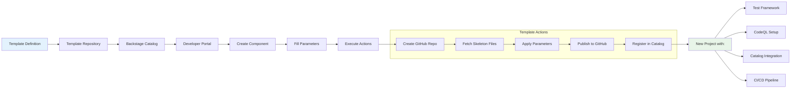

## Section 13: Exploring Backstage Scaffolder Templates

### Scaffolder Template Workflow



### Introduction to Scaffolder Templates
The Backstage **Scaffolder** (part of the Software Templates feature) allows teams to create standardized, automated workflows for generating new projects, services, or components. Templates streamline onboarding, enforce best practices (e.g., test coverage setup), and reduce setup errors, directly supporting your client's goal of improving project resilience through consistent tooling and visibility. Templates are defined as YAML files, executed via Backstage’s UI, and can integrate with GitHub to create repos, initialize code, and set up CI/CD pipelines.

**Why Use Scaffolder Templates?**
- **Standardization:** Ensure new projects include test frameworks, `catalog-info.yaml`, and GitHub Actions for coverage.
- **Resilience:** Bootstrap projects with resilience-focused configurations (e.g., CodeQL, coverage reporting).
- **Automation:** Reduce manual setup, minimizing errors and improving developer experience.

**Use Case for Client:** Create a template that generates a Node.js project with Jest for test coverage, CodeQL for vulnerability scanning, and a `catalog-info.yaml` for Backstage integration, ensuring immediate visibility in the Resilience tab (from the [Project Resilience guide](./project_resilience_guide.md)).

**Assumptions:** Backstage is deployed on GKE or Cloud Run, GitHub integration is configured (see [GitHub Integration Guide](./github_integration.md)), and the `@backstage-community/plugin-code-coverage` and other resilience plugins are installed. Estimated workshop time: 30-45 minutes.

### Prerequisites
- **GitHub Permissions:** Ensure the GitHub App or PAT has `repo` (full access for repo creation), `workflow` (for Actions), and `admin:repo_hook` (for webhooks). Update in `app-config.yaml` if needed (see Section 2 of main guide).
- **Plugins:** The `@backstage/plugin-scaffolder` is included in Backstage core, but install `@backstage/plugin-scaffolder-backend` for backend actions:
  ```bash
  cd packages/backend
  yarn add @backstage/plugin-scaffolder-backend
  ```
- **Backend Setup:** In `packages/backend/src/index.ts`, add:
  ```typescript
  import { createBackend } from '@backstage/backend-defaults';
  import { scaffolder } from '@backstage/plugin-scaffolder-backend';

  const backend = createBackend();
  backend.add(scaffolder());
  backend.start();
  ```
- **Redeploy:** Build and push the Docker image, then restart: `kubectl rollout restart deployment backstage`.

**Facilitator Tip:** Pre-install the scaffolder backend in your demo instance. Verify GitHub permissions in the workshop to avoid repo creation failures.

### Step-by-Step: Creating a Scaffolder Template
We’ll create a template for a Node.js project with Jest for test coverage, CodeQL for vulnerabilities, and Backstage catalog integration, aligning with the resilience focus.

#### Step 13.1: Define the Template
Templates are stored as `template.yaml` files in a GitHub repo and registered in Backstage.

**Checklist for Template Creation:**
- [ ] **Create a Template Repository:**
  - In GitHub, create a new repo (e.g., `your-org/backstage-templates`).
  - Add a `template.yaml` file in the root:
    ```yaml
    apiVersion: scaffolder.backstage.io/v1beta3
    kind: Template
    metadata:
      name: nodejs-resilient-service
      title: Node.js Resilient Service
      description: Creates a Node.js service with Jest, CodeQL, and Backstage integration
    spec:
      owner: team-a
      type: service
      parameters:
        - title: Service Details
          required:
            - name
            - owner
          properties:
            name:
              title: Service Name
              type: string
              description: Unique name for the service
            owner:
              title: Owner
              type: string
              description: Team or user owning the service
      steps:
        - id: create-repo
          name: Create GitHub Repository
          action: github:repo:create
          input:
            repoUrl: 'github.com?owner=${{ parameters.owner }}&repo=${{ parameters.name }}'
            visibility: public
            description: Node.js service created by Backstage
        - id: fetch-template
          name: Fetch Base Template
          action: fetch:template
          input:
            url: ./skeleton
            values:
              name: ${{ parameters.name }}
              owner: ${{ parameters.owner }}
        - id: publish
          name: Publish to GitHub
          action: publish:github
          input:
            allowedHosts: ['github.com']
            repoUrl: 'github.com?owner=${{ parameters.owner }}&repo=${{ parameters.name }}'
    ```
- [ ] **Add Skeleton Files:** In the same repo, create a `skeleton/` directory with:
  - `package.json`:
    ```json
    {
      "name": "${{ values.name }}",
      "version": "1.0.0",
      "scripts": {
        "test": "jest --coverage"
      },
      "devDependencies": {
        "jest": "^29.0.0"
      }
    }
    ```
  - `.github/workflows/test.yml` (for test coverage):
    ```yaml
    name: Test with Coverage
    on: [push, pull_request]
    jobs:
      test:
        runs-on: ubuntu-latest
        steps:
          - uses: actions/checkout@v4
          - uses: actions/setup-node@v4
            with: { node-version: '18' }
          - run: npm install
          - run: npm test
          - run: |
              curl -X POST \
                -H "Content-Type: text/plain" \
                --data-binary @coverage/lcov.info \
                "${{ secrets.BACKSTAGE_URL }}/api/code-coverage/report?entity=component:default/${{ values.name }}&coverageType=lcov"
    ```
  - `.github/workflows/codeql.yml` (for vulnerabilities, from main guide Section 4).
  - `catalog-info.yaml`:
    ```yaml
    apiVersion: backstage.io/v1alpha1
    kind: Component
    metadata:
      name: ${{ values.name }}
      annotations:
        github.com/project-slug: ${{ values.owner }}/${{ values.name }}
        backstage.io/code-coverage: "true"
    spec:
      type: service
      lifecycle: production
      owner: ${{ values.owner }}
    ```
  - `src/index.js` and `tests/index.test.js` (basic Node.js app and Jest test).
- [ ] Commit and push to GitHub.

**Facilitator Tip:** Share the `backstage-templates` repo URL with participants. Show the `template.yaml` structure on a slide, explaining parameters and steps.

#### Step 13.2: Register the Template in Backstage
Import the template into Backstage’s catalog for use in the UI.

**Checklist:**
- [ ] **Register Template:** In Backstage UI, go to `Create > Register Existing Component` and enter the URL to `template.yaml` (e.g., `https://github.com/your-org/backstage-templates/blob/main/template.yaml`).
- [ ] **Add to Catalog:** Or configure auto-discovery in `app-config.yaml`:
  ```yaml
  catalog:
    locations:
      - type: url
        target: https://github.com/your-org/backstage-templates/blob/main/template.yaml
  ```
- [ ] **Verify:** Go to `Create` in Backstage UI. The “Node.js Resilient Service” template should appear.

**Gotcha:** Ensure the GitHub repo is accessible (public or token has access). Check logs if the template doesn’t load (`kubectl logs [POD_NAME]`).

#### Step 13.3: Use the Template
Create a new project and verify resilience integration.

**Checklist:**
- [ ] **Run Template:** In Backstage UI, click `Create > Node.js Resilient Service`. Enter:
  - Service Name: e.g., `my-new-service`.
  - Owner: e.g., `your-org`.
- [ ] **Execute:** Click `Create`. The scaffolder creates a GitHub repo, populates it with skeleton files, and triggers Actions.
- [ ] **Verify in Catalog:** Go to `Catalog > Components > my-new-service`. Check:
  - **Resilience Tab:** Coverage % (after Actions run) via `@backstage-community/plugin-code-coverage`.
  - **Vulnerabilities:** CodeQL results via `@roadiehq/backstage-plugin-security-insights`.
  - **Scorecard:** Resilience score via `@backstage-community/plugin-tech-insights` (if set up).

**Facilitator Tip:** Demo creating a service live. Show the new repo in GitHub and the Resilience tab in Backstage. Pause for participants to try (10-15 minutes).

### Enhancing Resilience with Templates
- **Test Coverage:** The template includes Jest and a coverage upload step, ensuring immediate visibility in the Resilience tab. Add thresholds (e.g., 80%) in `app-config.yaml`.
- **Vulnerabilities:** CodeQL is pre-configured, flagging security risks.
- **Automation:** Use scaffolder actions to notify teams (e.g., `publish:slack`) if coverage drops below thresholds.
- **Customizations:** Extend templates for other languages (e.g., Java with JaCoCo) or additional checks (e.g., linting, docs).

### Quirks and Gotchas
- **Permissions:** Missing `admin:repo_hook` scope prevents webhook setup, breaking automated Actions. Verify in GitHub App settings.
- **Template Errors:** Syntax errors in `template.yaml` (e.g., wrong action names) cause silent failures. Validate with a YAML linter.
- **Rate Limits:** GitHub API limits can slow repo creation for large orgs. Use a dedicated App with high limits.
- **Resilience Integration:** Ensure `catalog-info.yaml` annotations match plugin requirements (e.g., `backstage.io/code-coverage: "true"`).

### Troubleshooting
- **Template Not Visible:** Check `catalog.locations` in `app-config.yaml` and repo accessibility. Restart Backstage.
- **Repo Creation Fails:** Verify GitHub token/App scopes (`repo`, `admin:repo_hook`). Check GitHub API errors in logs.
- **Coverage Not Showing:** Ensure Actions workflow uploads reports and `BACKSTAGE_URL` secret is set. Test curl command manually.
- **Facilitator Tip:** Pre-test the template in your demo instance. Share logs (`kubectl logs`) to debug participant issues.

### Workshop Integration
- **Time:** Add 30-45 minutes: 10 for explanation, 15 for demo/hands-on, 10 for Q&A.
- **Demo:** Create a service and show the repo, Actions run, and Resilience tab. Use a projector to walk through `template.yaml`.
- **Q&A Prep:** “Can I add Python?” (Yes, update skeleton with pytest.) “How to enforce standards?” (Use Tech Insights checks in templates.)
- **Resources:** Backstage docs (https://backstage.io/docs/features/software-templates), community Slack.