# Backstage Workshop Diagrams

This document contains visual diagrams to help understand the Backstage workshop flow and architecture.

## Workshop Overview Flow

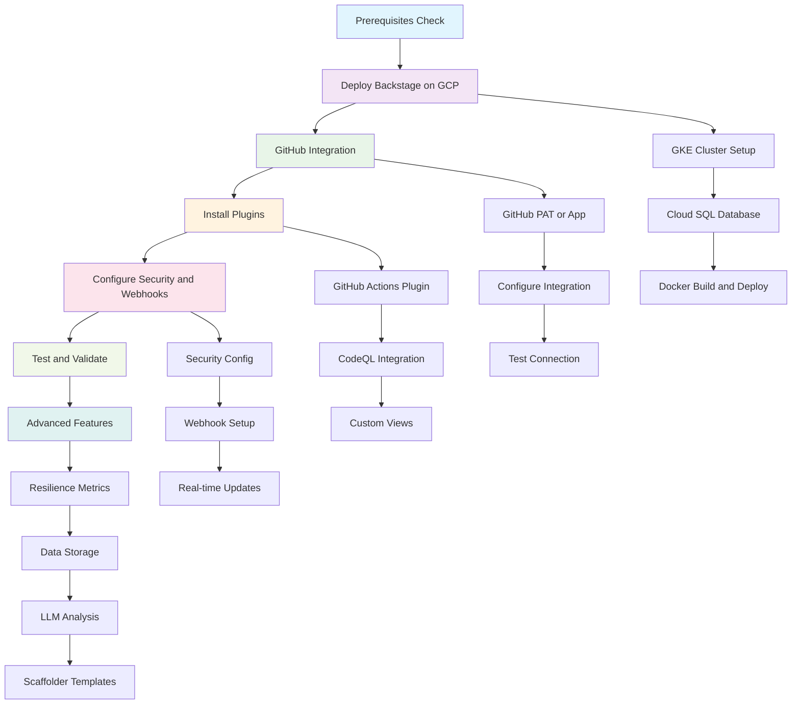

## Backstage Architecture on GCP

```mermaid
graph TB
    subgraph "Google Cloud Platform"
        subgraph "GKE Cluster"
            BS[Backstage Frontend]
            API[Backstage Backend API]
            PL[Plugins]
        end
        
        subgraph "Cloud SQL"
            DB[(PostgreSQL Database)]
        end
        
        subgraph "Artifact Registry"
            CR[Container Images]
        end
        
        LB[Load Balancer] --> BS
        BS --> API
        API --> PL
        API --> DB
        CR --> BS
    end
    
    subgraph "External Services"
        GH[GitHub]
        INT[Other Integrations]
    end
    
    API --> GH
    PL --> INT
    
    style BS fill:#4285f4
    style API fill:#34a853
    style DB fill:#ea4335
    style GH fill:#333
```

## GitHub Integration Flow

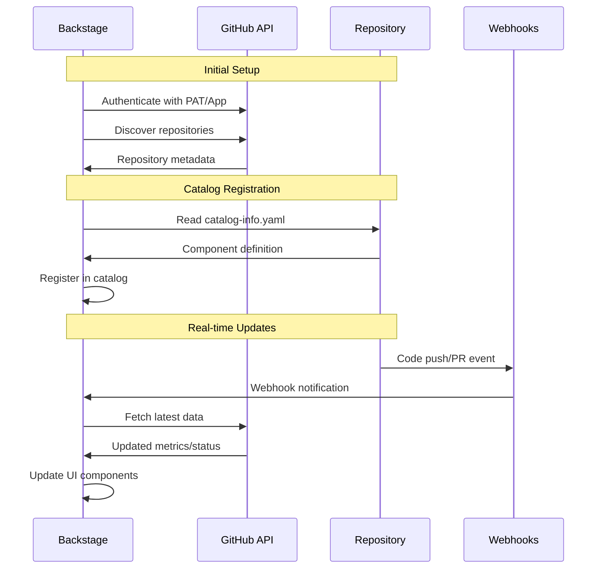

## Project Resilience Metrics

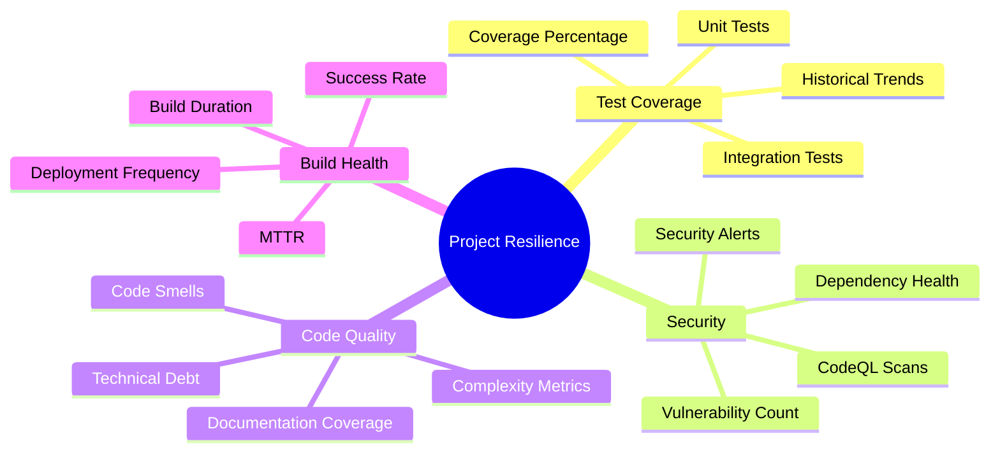

## Test Coverage Integration Flow

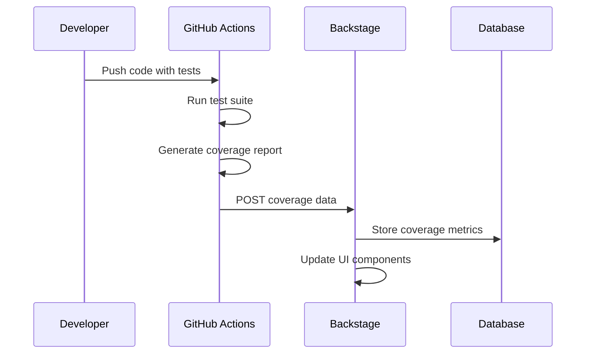

## Authentication Flow

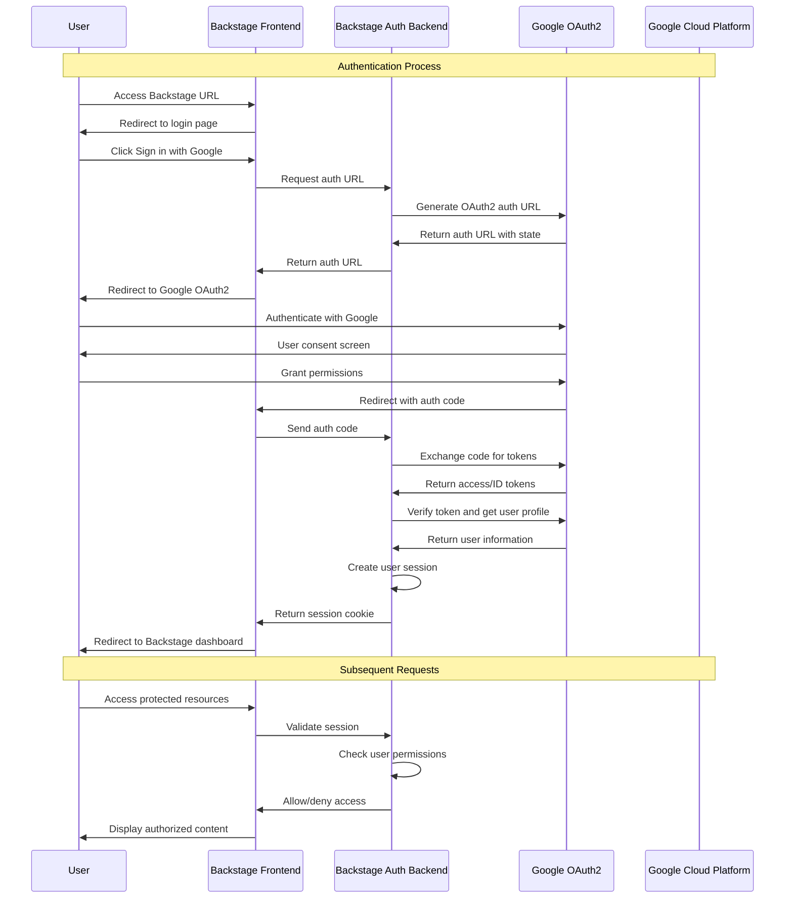

## Authentication Architecture on Google Cloud

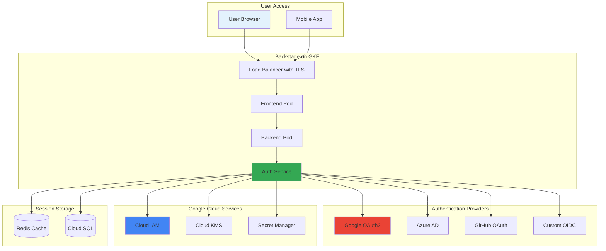

## Role-Based Access Control (RBAC)

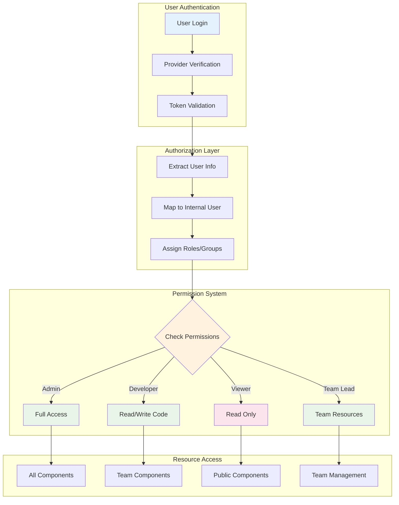

## Scaffolder Template Workflow

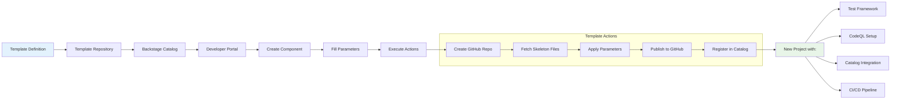

## Data Storage and LLM Analysis Architecture

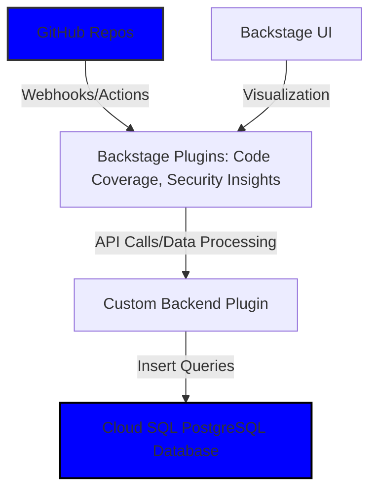

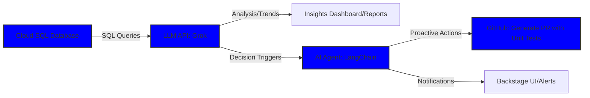