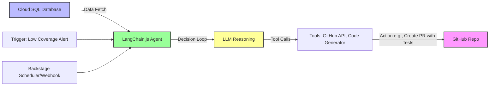

# Backstage: Exploring LangChain Integration for AI-Enhanced Resilience

## Introduction
This document explores integrating **LangChain** (and its JavaScript variant, LangChain.js) with Backstage to enhance LLM-driven analysis and AI Agent capabilities, building on the data storage setup from the "Storing and Analyzing GitHub Data for LLM Insights" document. LangChain is a framework for developing applications powered by LLMs, enabling chains (sequential prompts), agents (autonomous decision-makers with tools), and integrations with data sources like databases. In this context, it empowers Backstage to consume stored GitHub data (e.g., test coverage, vulnerabilities) for in-depth trend analysis and proactive actions, such as AI Agents generating unit tests for low-coverage areas.

**Why LangChain for Backstage?**
- **LLM Analysis:** Chain prompts to analyze database trends (e.g., "Identify coverage drops and correlate with vulnerabilities").
- **Agents:** Build autonomous agents that query data, decide actions, and execute (e.g., create GitHub PRs with generated tests).
- **Node.js Compatibility:** LangChain.js runs natively in Backstage's TypeScript environment, avoiding Python dependencies.
- **Client Use Case:** Extends visualization and storage to AI-driven insights, flagging resilience issues and automating fixes.

**Assumptions:** Backstage is deployed on Google Cloud with GitHub integration, resilience plugins, and the Cloud SQL database schema (from previous documents). We'll use LangChain.js with Google's Gemini LLM for seamless integration. Estimated workshop time: 45-60 minutes.

**Prerequisites:**
- **LangChain.js:** Install in Backstage's backend or a custom plugin.
- **LLM Provider:** A Gemini API key (or Vertex AI credentials for enterprise use) set as an environment variable.
- **Database Access:** Existing Cloud SQL setup with tables for coverage, vulnerabilities, etc.
- **GitHub Permissions Reminder:** Add `repo:write` for Agent PR creation; update in `app-config.yaml`.
- **Plugins Reminder:** Ensure `@backstage-community/plugin-tech-insights` and custom resilience-data-storage plugin (from previous document) are installed.

**Checklist for Prerequisites:**
- [ ] Install LangChain.js and Gemini integration: In `packages/backend`, run `yarn add @langchain/core @langchain/google-genai langgraph` (for agents).
- [ ] Verify database: Run `SELECT * FROM coverage_metrics;` in `psql` to confirm data.
- [ ] Set Gemini API key: `kubectl set env deployment/backstage GEMINI_API_KEY=[YOUR_KEY]`.
- [ ] Redeploy: `kubectl rollout restart deployment backstage`.

**Alternative: Google Vertex AI**
For enterprise features (e.g., managed infrastructure, compliance), use `@langchain/google-vertexai` instead: `yarn add @langchain/google-vertexai`. Authenticate via GCP credentials (e.g., service account JSON in environment vars). Swap imports to `ChatVertexAI` for similar functionality.

**Facilitator Tip:** Share LangChain.js docs (js.langchain.com) and demo a simple chain locally. Emphasize it's for Node.js to avoid confusion with Python LangChain.

## Architecture Overview
LangChain integrates with Backstage's backend to query the database, run LLM chains for analysis, and deploy agents for actions. Below are Mermaid diagrams for the proposed approaches.

### Basic LLM Chain Architecture (for Analysis)
This flow uses LangChain chains to analyze stored data.

```mermaid
graph TD
    A[Cloud SQL Database] -->|SQL Query| B[LangChain.js Chain]
    B -->|Prompt Engineering| C[LLM e.g., Gemini]
    C -->|Analysis Output| D[Backstage UI: Insights Tab]
    E[User Query e.g., "Trends in coverage?"] --> B
    style A fill:#bbf,stroke:#333,stroke-width:2px
    style C fill:#ff9,stroke:#333,stroke-width:2px
    style D fill:#f9f,stroke:#333,stroke-width:2px
```

### AI Agent Architecture (for Proactive Actions)
Agents use tools (e.g., GitHub API) to act on analysis, like generating tests.



**Facilitator Tip:** Use these diagrams in slides. Explain chains as "simple workflows" and agents as "smart decision-makers" for beginners.

## Section 1: Setting Up LangChain.js in Backstage
Integrate LangChain.js into a custom plugin for LLM chains and agents.

**Step-by-Step Setup:**

1. **Create/Extend Custom Plugin**
   - Build on the resilience-data-storage plugin (from previous document) or create new.

**Checklist:**
- [ ] Extend backend: In `plugins/resilience-data-storage-backend/src/service/router.ts`, import LangChain:
  ```typescript
  import { ChatGoogleGenerativeAI } from '@langchain/google-genai';  // For Gemini
  import { ChatPromptTemplate } from '@langchain/core/prompts';
  ```
- [ ] Add chain endpoint for analysis:
  ```typescript
  router.get('/llm-analyze', async (req, res) => {
    const { entity_ref } = req.query;
    const data = await knex('coverage_metrics').where('entity_ref', entity_ref).orderBy('timestamp', 'desc');
    const prompt = ChatPromptTemplate.fromMessages([
      ['system', 'You are an analyst for software resilience.'],
      ['human', 'Analyze this coverage data for trends: {data}. Suggest improvements.'],
    ]);
    const model = new ChatGoogleGenerativeAI({ apiKey: process.env.GEMINI_API_KEY });
    const chain = prompt.pipe(model);
    const response = await chain.invoke({ data: JSON.stringify(data) });
    res.json(response.content);
  });
  ```
- [ ] Redeploy and test: Call `/api/resilience-data-storage/llm-analyze?entity_ref=my-service` via curl or UI.

**Alternative for Vertex AI:** Swap to `@langchain/google-vertexai` and `new ChatVertexAI({ project: process.env.GCP_PROJECT, location: 'us-central1' });` with proper auth (e.g., `GOOGLE_APPLICATION_CREDENTIALS` env var pointing to service account JSON).

**Facilitator Tip:** Demo a chain output (e.g., "Coverage trending down—focus on new modules"). Use Gemini for simplicity, but mention Vertex for enterprise-scale deployments.

**Gotcha:** API keys must be secure (use Kubernetes Secrets). Rate limits may apply for frequent queries. Some users report occasional unreliability with Gemini outputs, so validate responses.

## Section 2: Building LLM Agents with LangGraph
Use LangGraph (LangChain's graph-based agent framework) for proactive agents that analyze data and act (e.g., generate tests).

**Step-by-Step Setup:**

1. **Implement Agent**
   - Agents loop through reasoning, tool calls, and actions.

**Checklist:**
- [ ] Add LangGraph: `yarn add langgraph`.
- [ ] Define agent in plugin:
  ```typescript
  import { AgentExecutor } from 'langchain/agents';
  import { createReactAgent } from '@langchain/langgraph/prebuilt';

  // Example: Agent to generate tests
  router.post('/agent-generate-tests', async (req, res) => {
    const { entity_ref } = req.body;
    const data = await knex('coverage_metrics').where('entity_ref', entity_ref).where('coverage_percentage', '<', 80);
    const model = new ChatGoogleGenerativeAI({ apiKey: process.env.GEMINI_API_KEY });
    const tools = [
      // Custom tool: GitHub API for PR
      {
        name: 'create_pr',
        description: 'Create GitHub PR with generated code',
        func: async (input) => { /* Use Octokit to create PR */ return 'PR created'; },
      },
      // Tool to generate code
      {
        name: 'generate_tests',
        description: 'Generate unit tests for low coverage',
        func: async (input) => {
          const codePrompt = `Generate Jest tests for: ${input.codeSnippet}`;
          // Call LLM for code generation
          return 'Generated tests...';
        },
      },
    ];
    const agent = createReactAgent({ tools, llm: model });
    const response = await agent.invoke({ input: `For ${entity_ref}, low coverage in ${JSON.stringify(data)}. Generate tests and PR.` });
    res.json(response.output);
  });
  ```
- [ ] Integrate tools: Use `@octokit/core` for GitHub interactions (`yarn add @octokit/core`).
- [ ] Trigger: Add a button in Resilience tab to call the endpoint; or schedule via GKE cron.

**Alternative for Vertex AI:** Use `new ChatVertexAI(...)` as the model in the agent setup, with Vertex-specific auth for production-scale reliability.

**Facilitator Tip:** Demo an agent creating a mock PR. Highlight LangGraph for complex workflows (e.g., multi-step reasoning).

**Gotcha:** Agents can loop indefinitely—set max iterations. Review generated code before merging.

## Section 3: Advanced Integrations and Examples
- **RAG with Backstage:** Use LangChain's retrieval chains to augment LLMs with catalog data (e.g., Roadie RAG AI plugin).
- **Google Cloud Integrations:** Leverage Gemini models directly or via Vertex AI for cloud-native setups, including database integrations like BigQuery for scaled analysis.
- **Client Example:** Agent detects <70% coverage, generates tests, and opens PR—tied to database trends.

## Wrap-Up and Best Practices
- **Testing:** Start with chains, then agents; use mocks for GitHub actions.
- **Security:** Sanitize inputs; use RBAC for Agent endpoints (main guide, Section 12).
- **Scaling:** Offload to Cloud Run for heavy computations, or use Vertex AI for managed infrastructure.
- **Resources:** LangChain.js docs (js.langchain.com), Google Gemini docs (developers.google.com/gemini), Backstage AI plugins (backstage.io/plugins).

**Q&A Prep:** "Python vs. JS?" (Use JS for Backstage; proxy to Python if needed). "Production Readiness?" (Monitor costs; human-in-loop for actions).

This integration unlocks AI-powered resilience in Backstage. For custom agents, explore LangGraph tutorials.