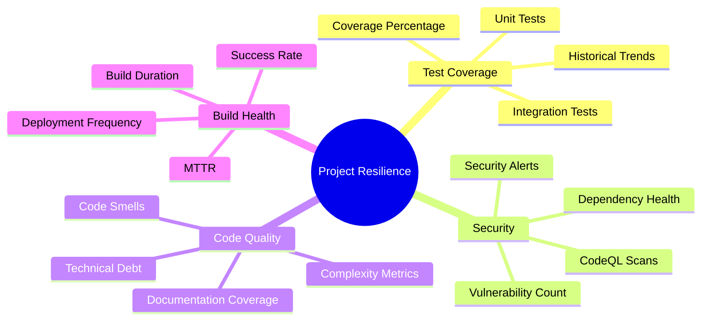
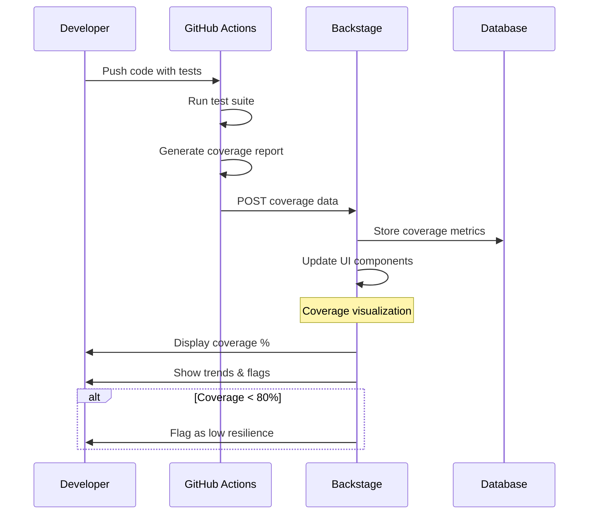

# Backstage: Project Resilience Guide

## Project Resilience Overview



## Introduction
This document focuses on leveraging Backstage to enhance **project resilience**—the ability of software projects to withstand and recover from issues like bugs, security threats, and technical debt. Resilience visibility helps teams proactively identify and address risks, ensuring reliable, maintainable codebases. The primary emphasis is on **test coverage**, as requested by the customer, which measures the percentage of code exercised by tests and indicates robustness against regressions.

We'll cover:
- **Test Coverage:** Integration and visualization of coverage metrics from CI/CD pipelines.
- **Vulnerabilities:** Scanning and alerting for security issues (e.g., via CodeQL).
- **Other Resilience Factors:** Brief overviews of metrics like code smells, documentation coverage, and build stability.

This guide assumes Backstage is already installed on Google Cloud (per the [Installation Guide](./installation_guide.md)) and integrated with GitHub (see [GitHub Integration Guide](./github_integration.md)). We'll include reminders for required GitHub permissions and community plugins. Steps are hands-on, with checklists for group workshops. Estimated time: 45-60 minutes.

**Goals:**
- Embed resilience metrics into Backstage entity pages for at-a-glance visibility.
- Flag projects below thresholds (e.g., <80% test coverage) for remediation.
- Use Tech Insights for aggregated scorecards across projects.

## Reminder: Required GitHub Permissions and Community Plugins
Before proceeding, ensure your GitHub integration (via PAT or App) has the necessary scopes. Add these to your existing token/App if missing.

**GitHub Permissions Reminder:**
- **For Test Coverage and CI/CD:** `repo` (full repo access), `workflow` (read workflows).
- **For Vulnerabilities (CodeQL/Security):** `security_events` (read security scans), `dependabot` (if using dependency alerts).
- **General Resilience Metrics:** `metadata` (repo metadata), `contents` (read code for scans).
- **Update in Backstage:** In `app-config.yaml`, verify `integrations.github.token` or App config includes these scopes. Redeploy: `kubectl rollout restart deployment backstage`.

**Community Plugins Involved:**
- `@backstage-community/plugin-code-coverage`: For test coverage reporting and history.
- `@roadiehq/backstage-plugin-security-insights` or `@backstage-community/plugin-github-insights`: For vulnerabilities.
- `@backstage-community/plugin-tech-insights`: For aggregating metrics into scorecards (e.g., resilience scores).
- `@backstage-community/plugin-github-actions`: For CI/CD context (already in main guide).

**Installation Reminder Checklist:**
- [ ] Install plugins: In `packages/app`, run `yarn add [PLUGIN_NAME]` (e.g., `yarn add @backstage-community/plugin-code-coverage`).
- [ ] Register in `packages/app/src/plugins.ts`: Import and export (e.g., `export const codeCoveragePlugin = CodeCoveragePage;`).
- [ ] Add to `EntityPage.tsx`: Include components in a new "Resilience" tab (details below).
- [ ] Backend setup: For code-coverage and tech-insights, add to `packages/backend/src/index.ts`: `backend.add(import('@backstage-community/plugin-code-coverage-backend'));`.
- [ ] Redeploy: Build/push Docker image and restart deployment.
- [ ] Test: Run `yarn dev` locally to verify.

**Facilitator Tip:** If GitHub permissions are missing, participants may see empty data. Demo updating scopes in GitHub settings. Pre-install plugins in your demo instance.

## Section 1: Test Coverage Visibility (Primary Focus)

### Test Coverage Integration Flow



Test coverage tracks how much code is tested, reducing risk of undetected bugs. We'll integrate coverage reports from GitHub Actions (e.g., Jest, JaCoCo) into Backstage, showing current percentage, history, and thresholds for flagging low-resilience projects.

**Assumptions:** Your repos use tools like Jest (JS) or JaCoCo (Java) in GitHub Actions, generating reports in formats like Cobertura XML or LCOV.

**Step-by-Step Setup:**

1. **Configure Coverage Reporting in GitHub Actions**
   - Add a step to your workflow (e.g., `.github/workflows/test.yml`) to publish coverage to Backstage.

**Checklist:**
- [ ] Update workflow YAML:
  ```yaml
  name: Test with Coverage
  on: [push, pull_request]
  jobs:
    test:
      runs-on: ubuntu-latest
      steps:
        - uses: actions/checkout@v4
        - name: Run Tests
          run: npm test -- --coverage  # Or your test command (e.g., mvn test for JaCoCo)
        - name: Publish Coverage
          run: |
            curl -X POST \
              -H "Content-Type: text/xml" \  # Or application/json for LCOV
              --data-binary @coverage/cobertura-coverage.xml \
              "${{ secrets.BACKSTAGE_URL }}/api/code-coverage/report?entity=component:default/[COMPONENT_NAME]&coverageType=cobertura"
  ```
  Replace `[COMPONENT_NAME]` with your Backstage entity ref (from `catalog-info.yaml`, e.g., `my-service`). Set `BACKSTAGE_URL` as a repo secret (e.g., `http://[EXTERNAL_IP]`).
- [ ] For JaCoCo/Cobertura: Ensure reports are generated in `target/site/jacoco/jacoco.xml` or similar.
- [ ] Commit and push: Trigger a run to test.

2. **Integrate Plugin in Backstage**
   - Use `@backstage-community/plugin-code-coverage` to display metrics on entity pages.

**Checklist:**
- [ ] Annotate `catalog-info.yaml` in repo root:
  ```yaml
  metadata:
    annotations:
      backstage.io/code-coverage: "true"  # Enables coverage fetching
      github.com/project-slug: [ORG]/[REPO]
  ```
- [ ] Add to `EntityPage.tsx` (in `packages/app/src/components/catalog/`):
  ```typescript
  import { EntityCodeCoverageContent } from '@backstage-community/plugin-code-coverage';

  // In serviceEntityPage
  <EntityLayout.Route path="/resilience" title="Resilience">
    <Grid container spacing={3}>
      <Grid item md={6}>
        <EntityCodeCoverageContent />
      </Grid>
    </Grid>
  </EntityLayout.Route>
  ```
  This adds a "Resilience" tab with coverage charts/history.
- [ ] Configure thresholds in `app-config.yaml` (optional):
  ```yaml
  codeCoverage:
    thresholds:
      warning: 70  # Flag yellow below 70%
      error: 50    # Flag red below 50%
  ```
- [ ] Redeploy and verify: Navigate to a component > Resilience tab. View current coverage %, historical trends, and flags (e.g., "Low Coverage: Improve tests").

**Flagging Low Resilience:** If coverage <80%, the plugin highlights the project. Use Tech Insights (Section 3) for automated alerts.

**Facilitator Tip:** Use a sample repo with Jest tests. Show a before/after: Empty tab vs. coverage graph. Discuss thresholds (e.g., aim for 80%+ for resilience). For troubleshooting coverage integration issues, refer to the [FAQ & Troubleshooting Guide](./faq_troubleshooting.md).

## Section 2: Vulnerabilities Visibility
Vulnerabilities (e.g., from CodeQL) indicate security risks that erode resilience. Integrate scans to show counts, severities, and remediation status.

**Step-by-Step Setup:**

1. **Enable CodeQL in GitHub**
   - Already covered in main guide (Section 4), but ensure it's running on PRs/pushes.

**Checklist:**
- [ ] Verify `.github/workflows/codeql.yml` exists and scans for vulnerabilities.
- [ ] Token has `security_events` scope.

2. **Integrate Plugin in Backstage**
   - Use `@roadiehq/backstage-plugin-security-insights` for vulnerability widgets.

**Checklist:**
- [ ] Install: `yarn add @roadiehq/backstage-plugin-security-insights`.
- [ ] Add to `plugins.ts`: `export const securityInsightsPlugin = SecurityInsightsPage;`.
- [ ] Add to `EntityPage.tsx` (in Resilience tab):
  ```typescript
  import { EntitySecurityInsightsContent } from '@roadiehq/backstage-plugin-security-insights';

  // In Resilience tab
  <Grid item md={6}>
    <EntitySecurityInsightsContent />
  </Grid>
  ```
- [ ] Configure in `app-config.yaml`:
  ```yaml
  securityInsights:
    githubToken: ${GITHUB_TOKEN}  # With security_events scope
  ```
- [ ] Redeploy and verify: See vulnerability counts (e.g., "5 High Severity"), trends, and links to GitHub alerts.

**Flagging:** Projects with >3 high-severity vulns are flagged as low-resilience.

**Alternative:** For broader scans, use Mend.io plugin (`@mend.io/backstage-plugin-mend`) for dependency vulns.

**Facilitator Tip:** Run a CodeQL scan on a test repo with known vulns. Highlight how it ties to resilience (e.g., unpatched vulns = outage risk).

## Section 3: Other Resilience Factors
Beyond coverage and vulns, flag projects on:
- **Code Smells/Technical Debt:** High counts indicate maintainability issues (use SonarQube plugin: `@backstage-community/plugin-sonarqube`).
- **Documentation Coverage:** Low docs = knowledge gaps (Tech Insights fact retriever for doc %).
- **Build Stability:** Failed Actions runs (via GitHub Actions plugin).
- **Dependency Health:** Outdated libs (Dependabot integration).

**Quick Setup for Aggregated View:**
- Use `@backstage-community/plugin-tech-insights` for scorecards.
  - **Checklist:**
    - [ ] Install: `yarn add @backstage-community/plugin-tech-insights @backstage-community/plugin-tech-insights-backend-module-jsonfc`.
    - [ ] Backend: Add `backend.add(import('@backstage-community/plugin-tech-insights-backend'));`.
    - [ ] Define facts (e.g., in `app-config.yaml` or custom retriever): Coverage >80%, Vulns <5.
    - [ ] Create scorecard: In Backstage UI > Tech Insights > New Scorecard (e.g., "Resilience Score: 0-100 based on coverage/vulns").
    - [ ] Add to Resilience tab: `<TechInsightsScorecardList />`.
  - **Flagging:** Score <70 flags the project; auto-notify owners via scaffolder actions.

**Facilitator Tip:** Demo a scorecard showing a "red-flagged" project. Discuss extending to custom metrics (e.g., MTTR from incidents).

## Wrap-Up and Best Practices
- **Monitoring:** Set up alerts (e.g., via webhooks) for flagged projects.
- **Thresholds:** Customize per team (e.g., 90% coverage for critical services).
- **Next Steps:** Integrate SonarQube for smells; use Tech Insights for dashboards.
- **Production Notes:** Secure API endpoints for coverage uploads; scale backend for large orgs.

**Q&A Prep:** "How to handle legacy projects?" (Start with baselines, gradual improvements). "Custom metrics?" (Extend Tech Insights retrievers).