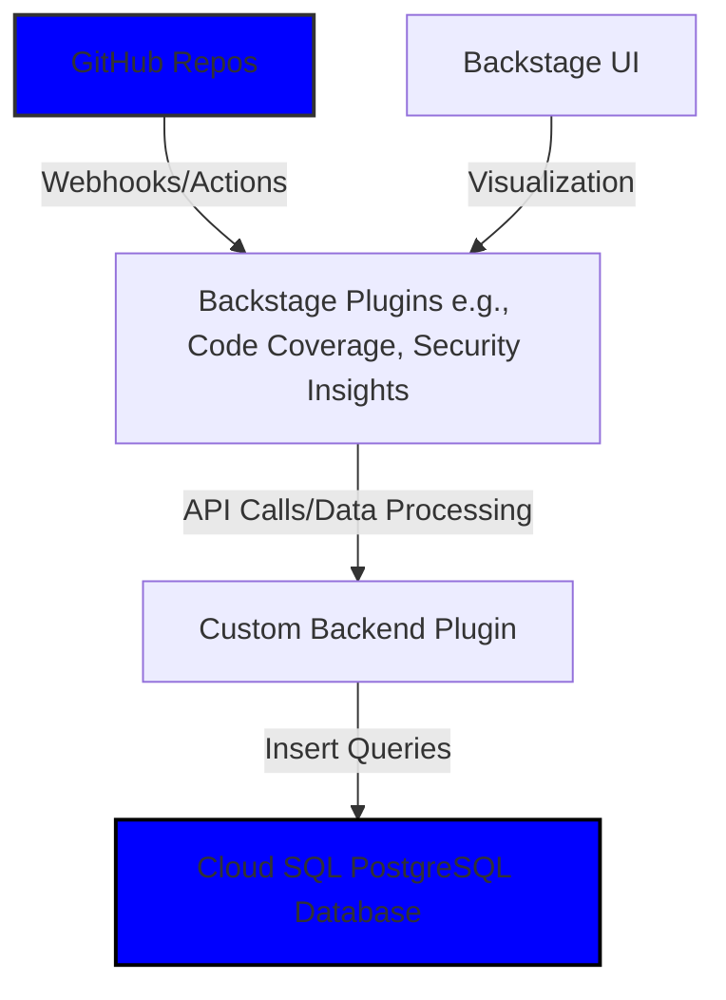
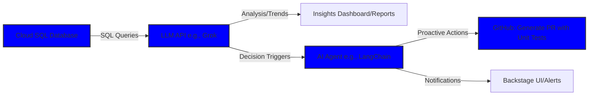

# Backstage: Storing and Analyzing GitHub Data for LLM Insights

## Introduction
This document extends your Backstage setup to store GitHub-derived data (e.g., test coverage, vulnerabilities, build metrics) in a database, enabling advanced analysis by a Large Language Model (LLM) and proactive actions by AI Agents (e.g., generating unit tests for low-coverage areas). Storing data centrally supports trend analysis, resilience insights, and automation, aligning with your client's goal of enhancing project resilience through data-driven decisions.

**Goals:**
- Store GitHub data from Backstage plugins in a Google Cloud SQL database.
- Structure data for LLM consumption (e.g., trend analysis, anomaly detection).
- Outline Agent-driven actions (e.g., auto-generating unit tests).
- Ensure compatibility with existing Backstage and GitHub integrations.

**Assumptions:** Backstage is deployed on Google Cloud (GKE or Cloud Run) with GitHub integration (main guide, Section 2) and resilience plugins (Project Resilience guide). The database will extend the existing Cloud SQL PostgreSQL instance. Estimated workshop time: 45-60 minutes.

## Prerequisites
- **Existing Setup:** Backstage with GitHub integration, `@backstage-community/plugin-code-coverage`, `@roadiehq/backstage-plugin-security-insights`, and `@backstage-community/plugin-tech-insights` installed.
- **Database:** Cloud SQL PostgreSQL instance (from main guide, Section 1) with access credentials.
- **GitHub Permissions Reminder:** Ensure the GitHub App/PAT has:
  - `repo` (for Actions, coverage), `security_events` (for vulnerabilities), `workflow` (for build metrics).
  - Update in `app-config.yaml` if needed: `integrations.github.apps` or `token`.
- **Plugins Reminder:** Verify backend plugins are installed:
  ```bash
  cd packages/backend
  yarn add @backstage-community/plugin-code-coverage-backend @backstage-community/plugin-tech-insights-backend
  ```
- **Tools:** `gcloud` CLI, `psql` for database access, Node.js/Yarn for plugin development.
- **LLM/Agent Integration:** For demo, use a simple LLM API (e.g., Grok API via xAI); in production, integrate with agents like LangChain or AutoGPT.
- **Facilitator Prep:** Pre-configure the database schema and a sample script to demonstrate data storage. Have a test repo with coverage and CodeQL data.

**Checklist for Prerequisites:**
- [ ] Verify Cloud SQL instance: `gcloud sql instances describe backstage-db`.
- [ ] Confirm GitHub scopes in Backstage UI (`Settings > Integrations > GitHub`).
- [ ] Ensure plugins are registered in `packages/backend/src/index.ts` (see Project Resilience guide).
- [ ] Test database access: `psql -h [CLOUD_SQL_IP] -U postgres -d backstage`.

**Facilitator Tip:** Share a slide with prerequisite checks. Demo database access to ensure everyone’s Cloud SQL is ready.

## Architecture Overview
The proposed approach involves data ingestion from GitHub via Backstage plugins, storage in Cloud SQL, LLM querying for analysis, and Agent actions for remediation. Below are Mermaid diagrams illustrating the architectures.

### Data Ingestion and Storage Architecture
This shows the flow from GitHub to Backstage to the database.



### LLM Analysis and Agent Action Architecture
This depicts LLM consumption of stored data and proactive Agent decisions.



**Facilitator Tip:** Use these diagrams in slides to explain the end-to-end flow. Highlight how data storage enables AI-driven insights beyond visualization.

## Section 1: Setting Up the Database Schema
Extend the existing Cloud SQL PostgreSQL database to store GitHub data (coverage, vulnerabilities, build metrics) for LLM analysis.

**Step-by-Step Setup:**

1. **Create Tables for GitHub Data**
   - Define tables for test coverage, vulnerabilities, and build metrics, linked to Backstage entities.

**Checklist:**
- [ ] Connect to Cloud SQL:
  ```bash
  gcloud sql connect backstage-db --user=postgres
  ```
  Enter your password (from main guide, Section 1).
- [ ] Create tables in the `backstage` database:
  ```sql
  CREATE TABLE coverage_metrics (
    id SERIAL PRIMARY KEY,
    entity_ref VARCHAR(255) NOT NULL,
    coverage_percentage FLOAT NOT NULL,
    lines_covered INTEGER,
    lines_total INTEGER,
    timestamp TIMESTAMP DEFAULT CURRENT_TIMESTAMP,
    report_type VARCHAR(50)  -- e.g., 'lcov', 'cobertura'
  );

  CREATE TABLE vulnerabilities (
    id SERIAL PRIMARY KEY,
    entity_ref VARCHAR(255) NOT NULL,
    severity VARCHAR(50),  -- e.g., 'high', 'medium', 'low'
    description TEXT,
    github_alert_id VARCHAR(100),
    timestamp TIMESTAMP DEFAULT CURRENT_TIMESTAMP
  );

  CREATE TABLE build_metrics (
    id SERIAL PRIMARY KEY,
    entity_ref VARCHAR(255) NOT NULL,
    workflow_run_id VARCHAR(100),
    status VARCHAR(50),  -- e.g., 'success', 'failure'
    duration_seconds INTEGER,
    timestamp TIMESTAMP DEFAULT CURRENT_TIMESTAMP
  );
  ```
- [ ] Verify tables: `\dt` in `psql` to list tables.

**Facilitator Tip:** Show the `psql` commands live. Provide a SQL file (`schema.sql`) for participants to run via `psql -f schema.sql`.

## Section 2: Capturing and Storing GitHub Data in Backstage
Modify Backstage to capture data from GitHub Actions, CodeQL, and plugins, then store it in the database using a custom backend plugin.

**Step-by-Step Setup:**

1. **Create a Custom Backend Plugin for Data Storage**
   - Extend existing plugins to persist data on events (e.g., workflow completions).

**Checklist:**
- [ ] Create plugin: In Backstage root, run:
  ```bash
  yarn create-plugin --id resilience-data-storage
  ```
- [ ] Add dependencies: In `plugins/resilience-data-storage-backend`, run:
  ```bash
  yarn add @backstage/backend-common pg knex
  ```
- [ ] Implement storage logic: In `plugins/resilience-data-storage-backend/src/service/router.ts`, add endpoints/routes to handle data insertion (e.g., from webhooks or plugin hooks):
  ```typescript
  import { Router } from 'express';
  import { PluginEnvironment } from '@backstage/backend-common';
  import Knex from 'knex';

  export default async function createPlugin({ logger, database }: PluginEnvironment) {
    const router = Router();
    const knex = Knex({
      client: 'pg',
      connection: database.getClient(),
    });

    // Example: Endpoint for storing coverage data (called from GitHub Actions or plugins)
    router.post('/store-coverage', async (req, res) => {
      const { entity_ref, coverage_percentage, lines_covered, lines_total, report_type } = req.body;
      await knex('coverage_metrics').insert({
        entity_ref,
        coverage_percentage,
        lines_covered,
        lines_total,
        report_type,
      });
      res.status(200).send('Data stored');
    });

    // Similar routes for vulnerabilities and build_metrics
    router.post('/store-vulnerability', async (req, res) => {
      // Insert logic here
      res.status(200).send('Data stored');
    });

    router.post('/store-build', async (req, res) => {
      // Insert logic here
      res.status(200).send('Data stored');
    });

    return router;
  }
  ```
- [ ] Register in `packages/backend/src/index.ts`:
  ```typescript
  import resilienceDataStorage from './plugins/resilience-data-storage-backend';

  backend.add(resilienceDataStorage());
  ```
- [ ] Hook into plugins: Modify `EntityCodeCoverageContent.tsx` or use event listeners to call the storage endpoint on data fetch (e.g., via `fetch` to `/api/resilience-data-storage/store-coverage`).
- [ ] Redeploy: Build/push Docker image and `kubectl rollout restart deployment backstage`.

**Facilitator Tip:** Walk through the plugin code. For demo, trigger a GitHub Action and show data insertion via `psql SELECT * FROM coverage_metrics;`.

**Gotcha:** Ensure database connections are secure (use Cloud SQL Proxy for local testing). Handle large datasets with indexing on `entity_ref` and `timestamp`.

## Section 3: LLM Consumption for Analysis and Trends
Query the stored data with an LLM for in-depth analysis (e.g., coverage trends over time, vulnerability patterns).

**Step-by-Step Setup:**

1. **Integrate LLM API**
   - Use a simple script or Backstage plugin to query the DB and feed to an LLM.

**Checklist:**
- [ ] Install LLM client: In a new frontend component or backend service, add:
  ```bash
  yarn add @xai/grok-sdk  # Or your LLM provider
  ```
- [ ] Create an analysis endpoint: In the custom plugin, add:
  ```typescript
  router.get('/analyze-trends', async (req, res) => {
    const { entity_ref } = req.query;
    const coverageData = await knex('coverage_metrics').where('entity_ref', entity_ref).orderBy('timestamp', 'desc');
    // Format data for LLM
    const prompt = `Analyze trends in this coverage data: ${JSON.stringify(coverageData)}. Identify drops in coverage and suggest improvements.`;
    // Call LLM API (e.g., Grok)
    const response = await fetch('https://api.x.ai/v1/chat/completions', {
      method: 'POST',
      headers: { 'Authorization': 'Bearer ${GROK_API_KEY}', 'Content-Type': 'application/json' },
      body: JSON.stringify({ model: 'grok-4', messages: [{ role: 'user', content: prompt }] }),
    });
    const analysis = await response.json();
    res.json(analysis.choices[0].message.content);
  });
  ```
  Set `GROK_API_KEY` as an environment variable.
- [ ] Add UI component: In `EntityPage.tsx` (Resilience tab), add a button to trigger `/api/resilience-data-storage/analyze-trends` and display results.
- [ ] Test: Query for an entity and view LLM output (e.g., "Coverage dropped 15% last month—add tests for new features").

**Facilitator Tip:** Demo a sample LLM response. Discuss prompts for trends (e.g., "Find correlation between vulns and build failures").

## Section 4: Proactive Decisions with AI Agents
Use Agents to act on LLM insights, e.g., generating unit tests for missing coverage.

**Step-by-Step Setup:**

1. **Set Up Agent Framework**
   - Integrate with tools like LangChain for Agent actions.

**Checklist:**
- [ ] Install: `yarn add langchain @langchain/openai` (or Grok equivalent).
- [ ] Create Agent logic: In backend, add:
  ```typescript
  import { initializeAgentExecutorWithOptions } from 'langchain/agents';
  import { ChatOpenAI } from '@langchain/openai';

  // Example Agent for generating tests
  async function runAgent(entity_ref: string) {
    const lowCoverageAreas = await knex('coverage_metrics').where('entity_ref', entity_ref).where('coverage_percentage', '<', 80);
    const model = new ChatOpenAI({ apiKey: process.env.GROK_API_KEY });
    const tools = [/* Custom tools: e.g., GitHub API for PR creation */];
    const executor = await initializeAgentExecutorWithOptions(tools, model, { agentType: 'chat-conversational-react-description' });
    const response = await executor.call({ input: `For entity ${entity_ref}, low coverage in ${JSON.stringify(lowCoverageAreas)}. Generate unit tests and create a GitHub PR.` });
    // Execute PR creation via GitHub API
    return response.output;
  }
  ```
- [ ] Expose endpoint: Add `/generate-tests` route calling `runAgent`.
- [ ] Trigger: From UI or scheduler (e.g., cron job in GKE).
- [ ] Verify: Run for a low-coverage entity; check generated PR in GitHub.

**Facilitator Tip:** Show a mock Agent run (e.g., generate sample tests). Emphasize ethical considerations (human review for Agent actions).

**Limitation:** Agents require robust error handling; start with supervised actions (e.g., draft PRs).

## Wrap-Up and Best Practices
- **Security:** Use encrypted connections (Cloud SQL IAM) and audit logs.
- **Scaling:** Index tables; use BigQuery for advanced analytics.
- **LLM/Agent Ethics:** Review outputs; avoid auto-merging code.
- **Next Steps:** Integrate with BigQuery for ML; expand to more metrics.

**Q&A Prep:** "How to handle large data?" (Partition tables by timestamp). "Custom LLMs?" (Fine-tune on your data).

This setup enables LLM-driven insights and Agent actions, transforming visualization into proactive resilience. For code, see Backstage plugins repo.