# Workshop Walkthrough: Backstage Integration

## Workshop Objective

**Primary Goal:** Demonstrate that Backstage can serve as a "single pane of glass" for test visibility by integrating with GitHub repositories and CodeQL scans.

**Success Criteria:** By end of session, you'll see:
- ✅ Your GitHub repositories listed in Backstage
- ✅ Test results from GitHub Actions visible in one view
- ✅ CodeQL security scan results displayed alongside test data
- ✅ Historical data stored in database for analysis

## Architecture Overview

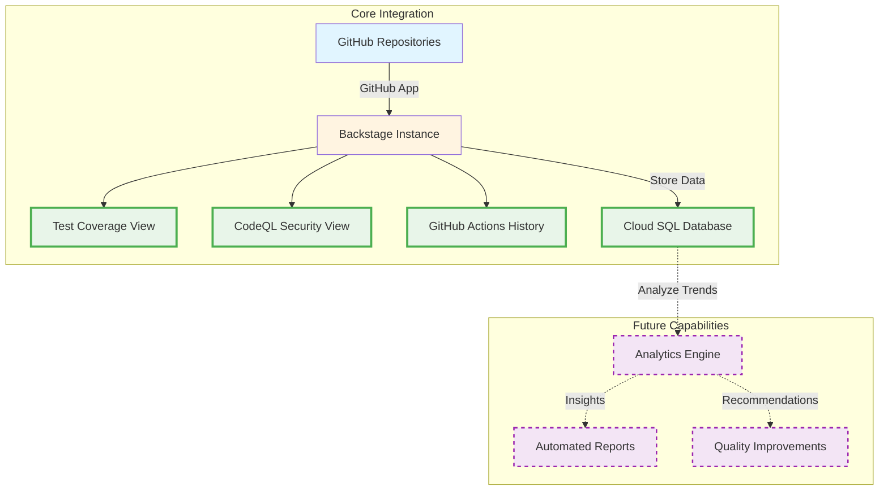

## Workshop Timeline

**Total Duration:** 3 hours (approximately 2:00 PM - 5:00 PM)

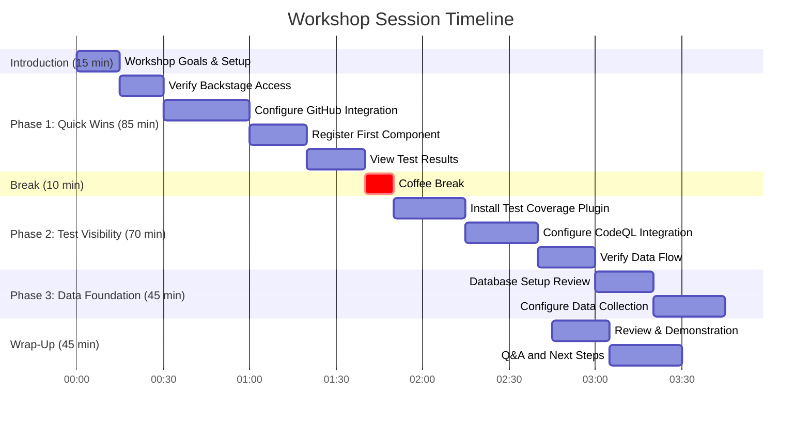

### Time Breakdown by Phase

| Phase | Start Time | Duration | Activities |
|-------|-----------|----------|------------|
| **Introduction** | Start | 15 min | Workshop goals, environment validation |
| **Phase 1: Quick Wins** | +15 min | 85 min | GitHub integration, component registration |
| **Break** | +1h 40min | 10 min | Coffee break, Q&A |
| **Phase 2: Test Visibility** | +1h 50min | 70 min | Coverage plugin, CodeQL integration |
| **Phase 3: Data Foundation** | +3h 00min | 45 min | Database setup, data collection |
| **Wrap-Up** | +2h 45min | 45 min | Review, demonstration, Q&A |

**Note:** Timeline is flexible. Adjust pacing based on group progress and questions.

## Phase 1: GitHub Integration Setup

### Integration Flow

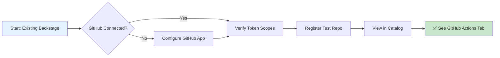

### Required GitHub Permissions

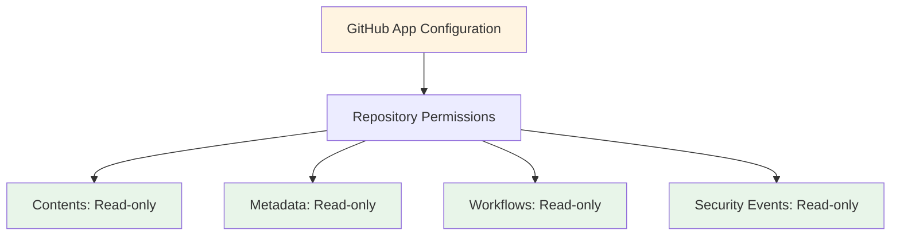

### Steps

1. **Create GitHub App**
   - Navigate to GitHub Settings > Developer Settings > GitHub Apps
   - Configure required permissions (see diagram above)
   - Generate private key
   - Install on target organization

2. **Configure Backstage**
   ```yaml
   integrations:
     github:
       - host: github.com
         apps:
           - appId: ${GITHUB_APP_ID}
             privateKey: ${GITHUB_PRIVATE_KEY}
             webhookSecret: ${GITHUB_WEBHOOK_SECRET}
             clientId: ${GITHUB_CLIENT_ID}
             clientSecret: ${GITHUB_CLIENT_SECRET}
   ```

3. **Register Component**
   - Create `catalog-info.yaml` in repository
   - Import component in Backstage
   - Verify visibility

**Deliverables:**
- GitHub integration configured
- At least one repository visible in Backstage
- GitHub Actions history displayed

---

## Phase 2: Test Visibility Configuration

### Test Coverage Integration

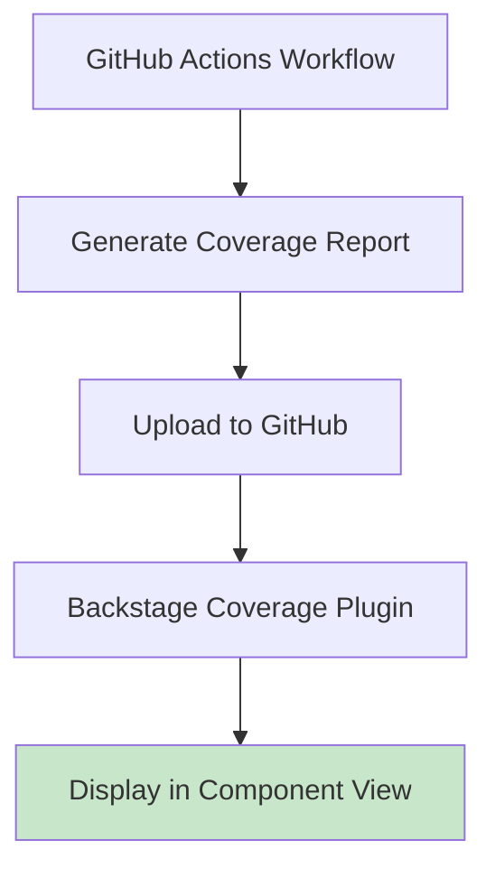

### CodeQL Security Integration

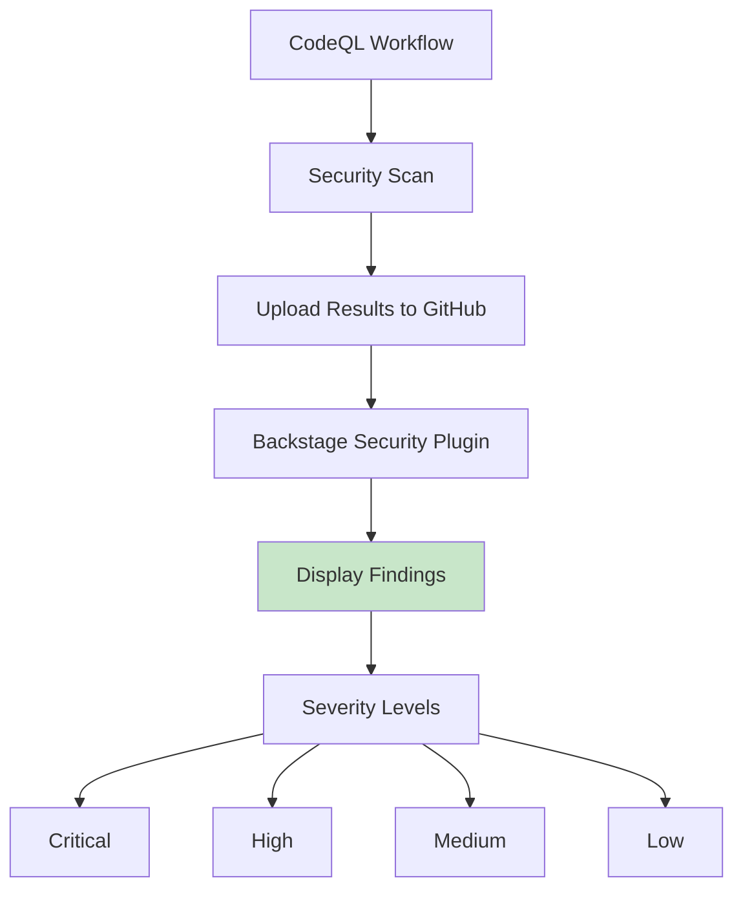

### Complete View Architecture

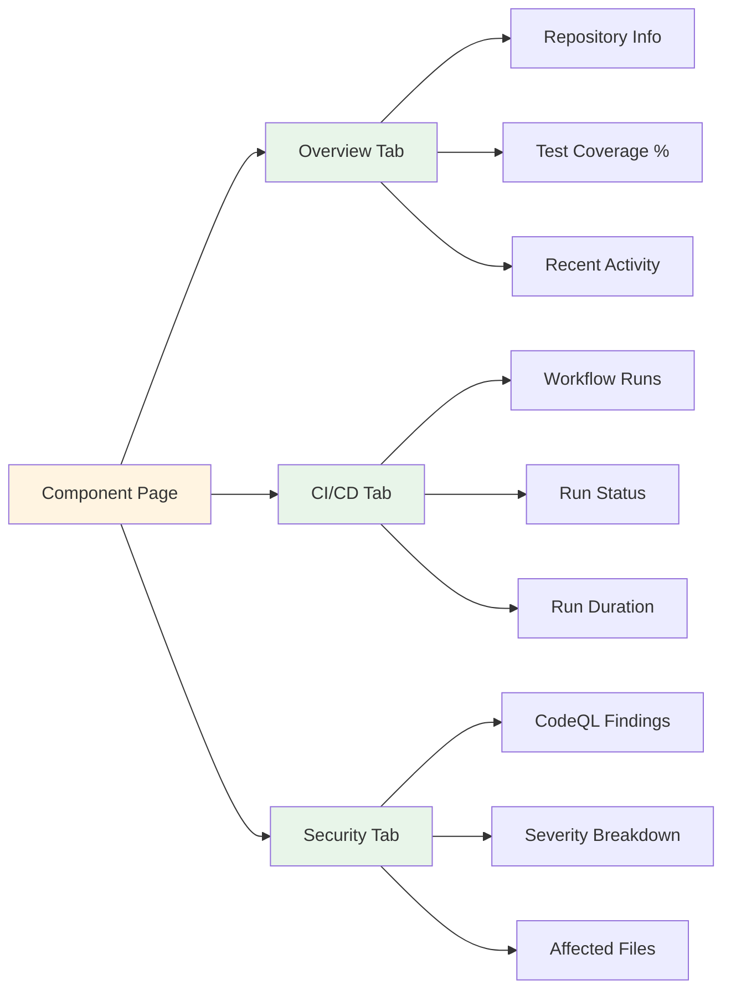

**Deliverables:**
- Test coverage percentages visible per component
- CodeQL security findings displayed
- Historical test run data accessible
- Single unified view of all test and security information

---

## Phase 3: Data Foundation

### Data Storage Architecture

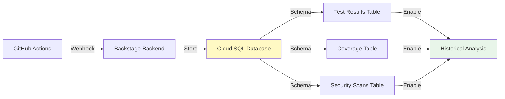

### Database Schema

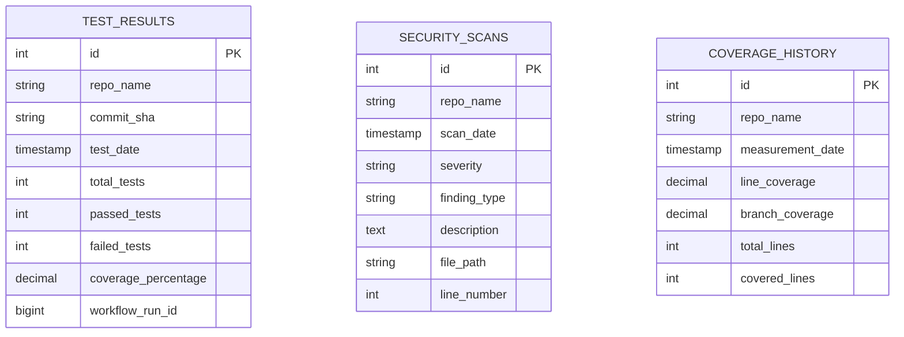

### Data Collection Flow

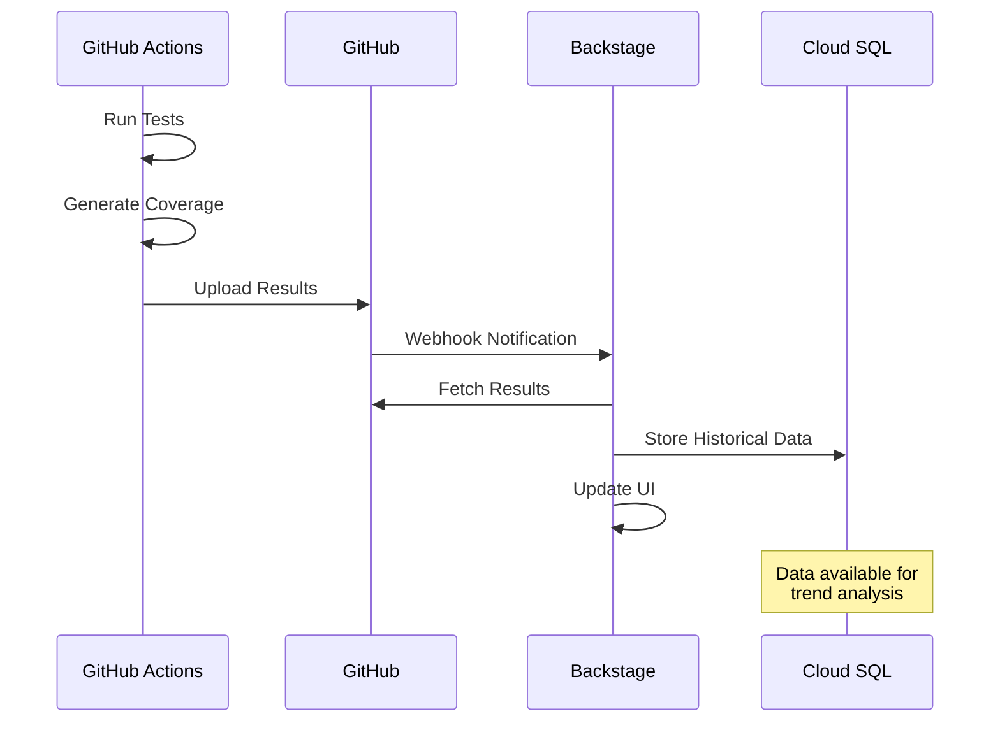

**Deliverables:**
- Database schema configured
- Data collection pipeline established
- Historical data queryable
- Foundation for advanced analytics

---

## Success Metrics

### Verification Checklist

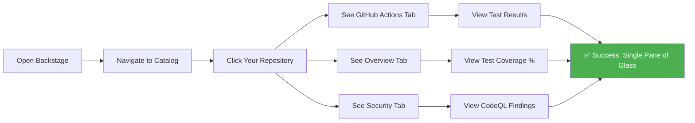

### What You Should See

1. **Backstage Catalog**
   - All registered repositories listed
   - Component metadata displayed
   - Owner and lifecycle information

2. **Component View - Overview Tab**
   - Repository description and links
   - Test coverage percentage
   - Recent commit history
   - Team ownership information

3. **Component View - CI/CD Tab**
   - GitHub Actions workflow runs
   - Run statuses (success/failure)
   - Run durations
   - Triggered by information

4. **Component View - Security Tab**
   - CodeQL security findings
   - Severity classifications
   - Affected file paths
   - Remediation guidance

5. **Database**
   - Historical test results stored
   - Coverage trends over time
   - Security scan history

---

## Troubleshooting Decision Tree

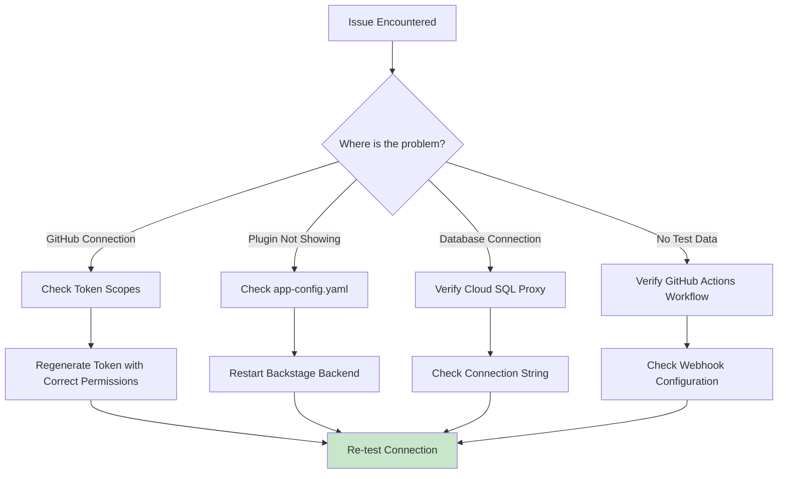

### Common Issues and Solutions

| Issue | Likely Cause | Solution |
|-------|-------------|----------|
| GitHub repos not showing | Incorrect GitHub App permissions | Verify app has Contents and Metadata read access |
| No test data visible | Coverage report not uploaded | Check GitHub Actions workflow uploads coverage artifacts |
| CodeQL findings missing | CodeQL not enabled on repo | Enable CodeQL in repository security settings |
| Database connection fails | Cloud SQL proxy not configured | Verify connection string and proxy setup |
| Plugin not appearing | Configuration not loaded | Restart Backstage backend after config changes |

---

## Permissions & Access Requirements

### GitHub Requirements

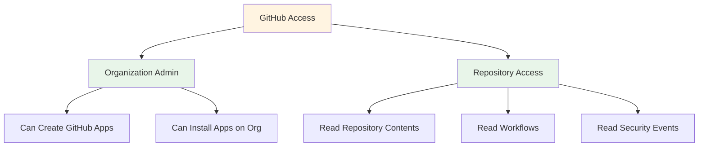

### Google Cloud Requirements

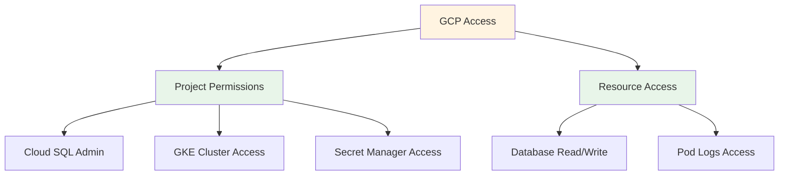

### Validation Checklist

- [ ] GitHub organization admin access
- [ ] At least one repository with existing tests
- [ ] GitHub Actions workflows configured
- [ ] CodeQL enabled on target repositories
- [ ] GCP project access
- [ ] Cloud SQL instance accessible
- [ ] Backstage instance running

---

## Implementation Timeline

```mermaid
timeline
    title Typical Implementation Phases
    
    section Phase 1: Foundation
        Week 1-2 : Configure GitHub integration
                 : Register initial repositories
                 : Install core plugins
    
    section Phase 2: Expansion
        Week 3-4 : Roll out to additional repositories
                 : Configure webhooks for real-time updates
                 : Set up monitoring and alerts
    
    section Phase 3: Data Collection
        Month 2 : Gather historical data
                : Validate data quality
                : Create baseline metrics
    
    section Phase 4: Advanced Analytics
        Month 3+ : Implement trend analysis
                 : Create custom dashboards
                 : Enable automated insights
```

---

## Key Capabilities Demonstrated

### 1. Unified Test Visibility
- View test results across all repositories
- Track test execution history
- Monitor test duration trends
- Identify flaky tests

### 2. Security Integration
- Display CodeQL security findings
- Track vulnerability remediation
- Monitor security posture over time
- Prioritize security work

### 3. Coverage Tracking
- Display test coverage percentages
- Track coverage trends
- Identify uncovered code paths
- Set coverage targets

### 4. Data Foundation
- Store historical test data
- Enable trend analysis
- Support data-driven decisions
- Foundation for advanced analytics

---

## Next Steps

After completing the workshop, consider:

1. **Expand Coverage**
   - Register additional repositories
   - Configure additional teams
   - Customize component views

2. **Enhance Integration**
   - Set up real-time webhooks
   - Configure custom notifications
   - Integrate with other tools

3. **Enable Analytics**
   - Build custom dashboards
   - Create trend reports
   - Implement automated insights

4. **Customize Experience**
   - Create custom plugins
   - Design team-specific views
   - Add organization branding

---

## Questions & Discussion Points

### Integration Questions
- How many repositories need to be integrated?
- Are all repositories in a single GitHub organization?
- Are there specific teams or projects to prioritize?

### Data Questions
- What historical data retention period is required?
- What specific metrics are most important?
- How should data be shared across teams?

### Workflow Questions
- What is the current test execution process?
- How are security findings currently tracked?
- What reporting is currently manual?

### Technical Questions
- What is the current Backstage version?
- Are there existing custom plugins?
- What is the preferred deployment method?

---

## Additional Resources

- [Installation Guide](../installation_guide.md) - Detailed Backstage setup on GCP
- [GitHub Integration Guide](../github_integration.md) - Complete GitHub configuration
- [Project Resilience Guide](../project_resilience_guide.md) - Test coverage configuration
- [Command Cheatsheet](../command_cheatsheet.md) - Quick reference commands
- [FAQ & Troubleshooting](../faq_troubleshooting.md) - Common issues and solutions

---

## Workshop Support

For questions during or after the workshop:
- Reference the [FAQ & Troubleshooting](../faq_troubleshooting.md) guide
- Check the [Workshop Facilitation Guide](../workshop_facilitation.md)
- Review the [Visual Diagrams](../diagrams.md) for architecture clarity
